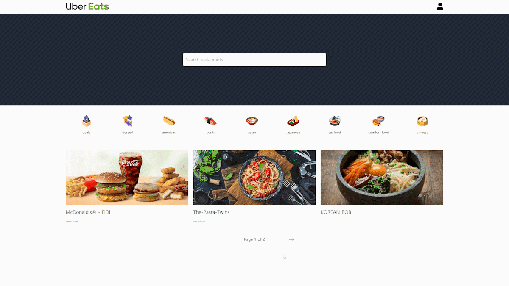
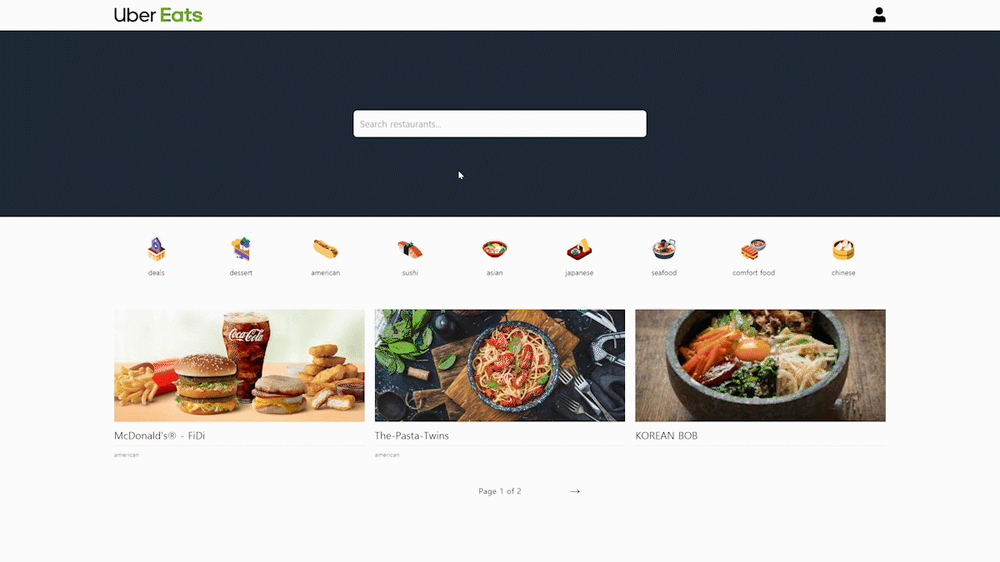
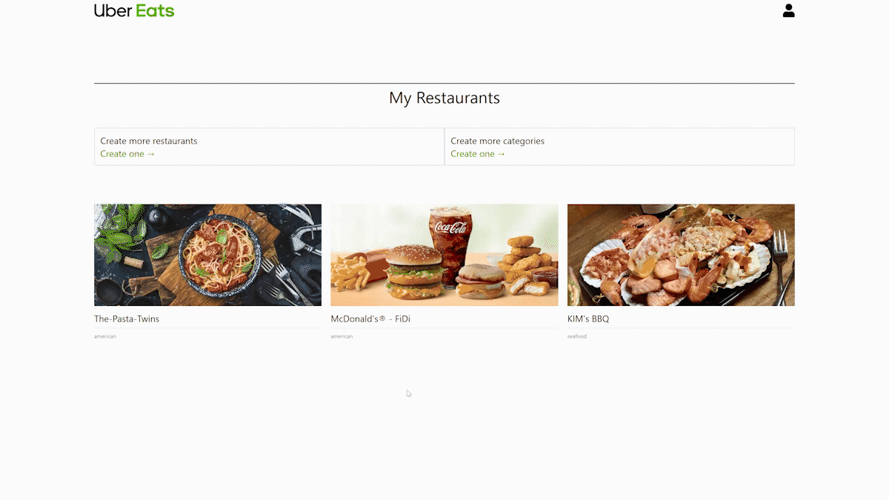

  
# Uber Eats Frontend
- https://github.com/nohsangwoo/uber-eats-backend 와 연동됩니다(BackEnd)
- deploy: https://uber-eats-clone-fe-noh.netlify.app/
    (백엔드배포된 서비스의 상태가 무료버전이라 처음 접속시 sleep된상태에서 깨어나느라 조금 시간이 걸림(1~2분정도 기다려야함))
- 설명에 첨부된 gif파일 크기로 인하여 readme파일을 불러오는데 시간이 좀더 소요될 수 있습니다. 조금 기다려주세요.

  

  

# 구현 내용 및 컨셉

|                        Users                        |                Restaurants                |
| :-------------------------------------------------: | :---------------------------------------: |
|                ✔ User Authentication                |             ✔ Restaurant CRUD             |
|                ✔ Email Verification                 |                ✔ Dish CRUD                |
|                   ✔ Photo Upload                    |     ✔ Realtime Order Notification      |
| ✔ User / Delivery Man/  Restaurant Owner Profile |   ✔ Premium Feature (Online Payment)   |
|                                                     | ✔ Sales Dashboard (Data Visualization) |

| Nest Concepts |            Feature            |
| :-----------: | :---------------------------: |
|   ✔ Modules   | ✔ Online Payments (paddle) |
|   ✔ Guards    |         ✔ Google Maps         |
| ✔ MiddleWares |        ✔ Unit Testing         |
| ✔ Decorators  |     ✔ End to End Testing      |
|               |        ✔ Tailwind CSS         |
|               |     ✔ JWT Authentication      |

  

  

# 사용된 기술

- React JS
- typescript(for javascript)
- apollo-graphql(for graphql)
- google maps API(for map)
- victory(for graph)
- tailwind css(for css)
- Cypress(for E2E testing)
- Jest(for unit testing)
- websocket(for realtime subscription)

  

  

# 주요 기능

## 1. realtime 상호작용 (apollo subscription을 이용한 Websocket 접근)

  

- 작동 순서 설명

1. delivery, Restaurant Owner, User순서로 화면에 나열함
2. owner는 자신의 소유 레스토랑중 하나를 선택하여 실시간으로 주문이 들어오는것을 감시 하고있는 상태로 대기
   (주문이 들어오면 자동으로 주문 진행하는 페이지로 넘어감)
3. user는 보이는 레스토랑중 하나(2번 owner의 레스토랑)를 선택하여 주문을 진행함
4. 주문 진행과 동시에 owner와 user는 주문 진행 현황 페이지로 push됨
5. owner는 주문이 들어오면 요리 시작을 실시간으로 알리는 cooking을 클릭하여 주문형황을 cooking으로 업데이트
6. cooking 선택시 user의 주문현황 페이지도 실시간으로 감지하여 주문 현황을 cooking으로 업데이트
7. owner는 요리가 끝나면 cooked로 업데이트 가능한 버튼을 누름
8. 주문형환이 cooked가 되면 user의 주문현황도 실시간으로 변경됨
9. 동시에 delovery man의 화면에 해당 cooked된 음식을 배달 시작할지 여부를 물어보는 accept버튼 활성화
10. 배달원이 accept버튼을 누르면 owner와 user의 주문현황 page에서 배달원의 정보를 실시간으로 업데이트
11. 배달원이 음식을 pickup하면 또한 owner와 user의 주문현황 page에서도 상태를 picked up으로 변경
12. 배달 완료시 배달원, 레스토랑주인, 사용자 3개의 모든 페이지에서 Delivered로 상태를 업데이트하고 "Thank you for using Uber Eats" 안내문과 함께 주문 완료
13. 프로젝트의 규모를 제한하려고 실시간 주문진행은 이정도에서 마무리함

- Description
  apollo subscription을 사용하여 websocket에 접근,
  delivery, Restaurant Owner, User(화면에 나열된 스크린 순서)가 서로 realtime으로 상호작용하는 기능

- setting up
  https://www.apollographql.com/docs/react/data/subscriptions/#setting-up-the-transport 참고

- subscription 사용예
  (dashboard.tsx)

- subscribeToMore
  subscriptoion은 변화가 있을때만 감지된 데이터를 가져와 알려줌
  즉 기본적으론 일반 Query문을 사용하여 데이터를 가져와 화면에 렌더링 하고,
  subscriptoion으로 "변경이 감지된 데이터"만 가져와 기존의 쿼리데이터에서 변경된 부분을 수동으로 업데이트하여 렌더링해야하는 불편함이 있다.
  apollo에서 위 번거로운 작업을 한번에 해결해주는 기능인 subscribeToMore을 제공함
  subscribeToMore은 useQuery에서 제공되는 기능중 하나
- subscribeToMore 사용예
  (order.tsx)

- https://www.apollographql.com/docs/react/data/subscriptions/#subscribing-to-updates-for-a-query 참고

  

  

## 2. pagination 기능(User)

(페이지당 3개내용)

  

- 한페이지당 3개의 reataurant이 노출되게 설정 및 다음페이지, 이전페이지 기능 구현
  DB에 저장된 레스토랑의 총 개수/3(페이지당 restaurant표시 개수)로 계산된 backend graphql기능
- pagination은 프론트에선 쿼리로 페이지와 함께 요청만하기 실질적인 기능 구현은 백엔드에서 담당함(graphql)
- pagination 사용예
  (category.tsx)

  

  

## 3. category 검색 기능(User)

  

- category 이미지를 클릭하면 해당 카테고리에 해당하는 restaurant를 검색해주는 기능 구현
- 사용예
  (category.tsx)

  

  

## 4. 검색어로 레스토랑이름 검색 기능(User)

  

- category 이미지를 클릭하면 해당 카테고리에 해당하는 restaurant를 검색해주는 기능 구현
- 없는 레스토랑 이름으로 검색시 안내 페이지 구현
- 사용예
  (search.tsx)

  

  

## 5. 내 정보 수정 기능(Any)

  

- email과 password를 수정하는 기능 구현
- 수정완료시 "Please enter a valid email" 안내문과 함께 email인증을 해야함
- 사용예
  (edit-profile.tsx)

  

  

## 6. 목적지까지 경로 안내(Delivery)

  

- Google maps Api를 이용하여 임의로 지정된 목적지까지 경로를 안내받는 기능 구현
- 사용예
  (dashboard.tsx)

  

  

## 7. 새로운 레스토랑 등록(Owner)

  

- restaurant owner가 자신 소유의 새로운 restaurant 생성하는 기능 구현
- 사용예
  (add-restaurants.tsx)

  

  

# 개선해야할 부분

1. 배달원의 위치 정보를 실시간으로 사용자와 레스토랑주인에게 공유하는 기능
2. 사용자의 집주소를 저장하는 기능 추가(해당 위치를 목표로하여 자동으로 배달원의 경로를 설정)
3. 현재 프로젝트의 규모를 제한하는 목적으로
   배달원은 레스토랑의 직속으로 배달 건수를 제공받는데
   이것을 여러명의 배달원이 여러개의 레스토랑의 주문중 하나를 선택하여 원하는 배달건을 쉽게 잡을수있게 개선
4. UI/UX 개선
5. paddle의 이용방침이 변경돼서 테스트모드 불가, paypal로 변경
6. logout기능

# category 구현

페이지는 존재하나...아직 내용이 없음

# edit-dish 구현(owner권한)

uuid 적용

<!-- 
 -->
